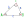
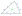
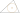

# solve-triangle



A triangle solving ES module without any dependencies.  
Calculates side lengths, angles, area, centroid, incircle, circumcircle and altitudes.  
Contains a function for solving based on side lengths and angles and one for solving based on coordinates.  
Interactive demos for both these functions are provided.  

## Installation

```npm
npm install solve-triangle
```

## Usage

```javascript
import {solve, solvePoints} from "solve-triangle"

/* Parameter is an Object containing side lengths and angles */
const solvedTriangle =  solve({a:1, b:1.5, gamma:30});

/* Parameters are coordinates represented by Arrays or Objects */
const solvedTriangle =  solvePoints(A:[0, 0], B:{x:-1, 2.5}, C:[10, -3]);

/* Return is Object with either an Array of solution Objects or an error message */
if(solvedTriangle.solutions.length>0){
    console.log(solvedTriangle.solutions)
}else{
    console.log(solvedTriangle.error)
}
```

## solve() - Solve triangles for given side lengths and angles

[Interactive Demo](https://mmeigel86.github.io/solve/solve.html)

Receives an Object containing a combination of known side lengths and angles and returns an Object containing the original parameters and possible solutions.  
Depending on the the given parameters there can be 0, 1 or 2 solutions.  
For every solution the area, incircle radius, circumcircle radius and altitudes are provided.  
If no solution could be found the return value will be an Object containing the original parameters and an `error` string that explains wether a solution could not be found due to unusable parameters or because none is possible.  
If you provided more than the 3 necessary parameters, `solve` will check if there is a mismatch between calculated values and the parameters which weren't used for solving the triangle. If this is the case no solution will be provided and `error` will be set. 

### Syntax

``` javascript
const solvedTriangle = solve({ a, b, c, alpha, beta, gamma, mode = "deg" });
```

All parameters are optional. At least 3 values must be provided, including at least one side length. Angles are treated as Degrees or Radians depending on the value of `mode`.  
Output angle mode is the same as input mode.

### Parameters

|Name|Type|Range|Explanation|
|---|---|---|---|
|a, b, c|number|0 < x| Side lengths |
|alpha, beta, gamma|number|0 < x < 180(deg)/2*Pi(rad)| Angle values |
|mode |string|"deg"(default) or "rad"|Angle mode. If "deg" all given and returned angles will be in Degrees. If "rad" all given and returned angles will be in Radians. |

### Return

[See Return Value](#return-value)

### Example 

```javascript
const solvedTriangle =  solve({a:1, b:1.5, gamma:30, mode :"deg"});
solvedTriangle=
{
  /* Original Parameters */
  a: 1,
  b: 1.5,
  gamma: 30,
  mode: 'deg',
  /* Array containing possible solutions */ 
  solutions: [
    {
      a: 1,
      b: 1.5,
      c: 0.8074179764203198,
      alpha: 38.26196619970986,
      beta: 111.73803380029015,
      gamma: 29.999999999999996,
      ha: 0.75,
      hb: 0.5,
      hc: 0.9288869233815157,
      area: 0.37499999999999994,
      incircle: { radius: 0.2267629931708054 },
      circumcircle: { radius: 0.8074179764203198 }
    }
  ]
}
```


## solvePoints() - Solve triangles for given cartesian coordinates

[Interactive Demo](https://mmeigel86.github.io/solve/solvePoints.html)

Receives 3 cartesian coordinates and returns an Object containing the original parameters and a possible solution.  
Depending on the the given parameters there can be 0 or 1 solutions.  
For every solution the area, centroid, incircle (radius and center), circumcircle (radius and center) and altitudes are provided.  
If no solution could be found the return value will be an Object containing the original parameters and an `error` string that explains wether a solution could not be found due to unusable parameters or because none is possible.  

### Syntax

```javascript
const solvedTriangle = solvePoints(A, B, C, mode = "deg" );
```

### Parameters

|Name|Type|Range|Explanation|
|---|---|---|---|
|A, B, C| \[x,y] \| {x, y} \| {X, Y}| - | Cartesian Coordinates, represented by Arrays or Objects. Types can be mixed. Duplicate coordinates are not allowed. |
|mode |string|"deg"(default) or "rad"| Angle mode. If "deg" all calculated angles will be in Degrees. If "rad" all calculated angles will be in Radians. |

### Example 

```javascript
const solvedTriangle =  solvePoints(A:[0, 0], B:{x:-1, 2.5}, C:[10, -3]);

solvedTriangle=
{
    /* Original Parameters */
    A: { x: 0, y: 0 },
    B: { x: -1, y: 2.5 },
    C: { x: 10, y: -3 },
    mode: deg,
    /* Array containing possible solutions */ 
    solutions: [
        {
            angleA: 128.50065372034547, //alpha
            angleB: 41.63353933657019,  //beta
            angleC: 9.865806943084344,  //gamma
            sideAB: 2.692582403567252,  //c
            sideBC: 12.298373876248844, //a
            sideCA: 10.44030650891055,  //b
            a: 12.298373876248844,
            b: 10.44030650891055,
            c: 2.692582403567252,
            alpha: 128.50065372034547,
            beta: 41.63353933657019,
            gamma: 9.865806943084344,
            ha: 1.7888543819998308,
            hb: 2.107217827486532,
            hc: 8.17059487979028,
            area: 10.999999999999996,
            centroid: {
                x: 2.9999999999999996,
                y: -0.16666666666666674
            },
            incircle: {
                center: {
                    x: 0.6482382594886238,
                    y: 0.708695404207926
                },
                radius: 0.8650769795730455
            },
            circumcircle: {
                center: {
                    x: 6.687499999999997,
                    y: 4.1250000000000195
                },
                radius: 7.8573711411642035
            }
        }
    ]
}
```

## Return Value

An Object containing the original parameters and possible solutions.  
If no solutions is possible the `solutions` Array will be empty and a string property `error` will explain why.  

|Name|Type|Explanation|
|---|---|---|
|Original parameters|any| The original parameters given to the function including default arguments like `mode`. |
|solutions|Array.solutionObject| Array of Objects representing solutions for the given triangle. There may be 0, 1 or 2 solutions per triangle.|
|error|string \| undefined | If no solution was found or parameters were unusable this will be a message explaining the issue. |

### solutionObject

Some properties are exclusive to solutions returned by one function.

|Name|Type|Explanation|solve/solvepoints|
|---|---|---|---|
|a, b, c|number|Side lengths |Both|
|sideAB, sideBC, sideCA|number| Alternative names for side lengths to make it more obvious which side connects which vertices. (AB=c, BC=a, CA=b) |solvepoints|
|alpha, beta, gamma|number|Angle values|Both|
|angleA, angleB, angleC|number| Alternative names for angle values to make it more obvious which vertice an angle belongs to. (angleA=alpha, angleB=beta, AngleC=gamma) |solvepoints|
|area|number|The area of the triangle.|Both|
|ha, hb, hc|number|Altitude lengths. |Both|
|centroid| {x: number, y: number} | The arithmetic mean point of all 3 vertices. Also known as geometric center, center of figure, center of mass or barycenter.|Only solvepoints|
|incircle|{center: {x: number, y: number}, radius: number}|The largest circle that fits into the triangle. Also known as the inscribed circle of the triangle.|No *center* when using solve|
|circumcircle|{center: {x: number, y: number}, radius: number}| A circle that passes through all of vertices of an triangle. Also known as the circumscribed circle of the triangle.|No *center* when using solve|

### Possible Errors

| `error` |Explanation|solve/solvePoints|
|---|---|---|
|"Unknown mode: *mode* - Must be 'deg' or 'rad'"| The given value for `mode` must be either "deg" or "rad".  |Both|
|"Unsolvable: No solution is possible for given parameters."| A triangle with the given parameters is impossible. |Both|
|"Unsolvable: Impossible combination of side lengths: *side_lengths*"|A triangle with the given parameters is impossible.|Both|
|"Unsolvable: At least 3 parameters must be given, inluding one side length."| You did not provide enough parameters. |solve|
|"Unsolvable: At least one parameter must be a side length"| You did not provide a side length. |solve|
|"Calculated value for *parameter* different from input: *inputValue* calculated: *calculatedValue*"| You have provided more than the 3 necessary parameters and there is a mismatch between calculated values and the parameters which weren't used for solving the triangle. |solve|
|"Illegal value: *side* = *value* - All side lengths must be numbers >0"| The given side length is either not a number(or a string that can be coerced to a number) or <=0. |solve|
|"Illegal value: *angle* = *value* - All angle values must be numbers >0 and <180(deg)" \| <Pi*2(rad)"|The given angle value is either not a number(or a string that can be coerced to a number) or out of the possible range for a triangle.|solve|
|"Illegal Parameter: *point*:*value* - Must be [x,y], {x,y} or {X,Y}."| The value is not an acceptable coordinate. |solvePoints|
|"Repeated Coordinates: *point1*: *coordinates1* and *point2: *coordinates2* - Coordinates must be unique."| The same coordinate was used twice. |solvePoints|

## distance() - Euclidian distance between two carteesian coordinates

Calculates distance between two coordinates. Accepts the same coordinate representations as `solvePoints`.  
Results are numbers >= 0, or `null` if one or more of the points aren't valid coordinates.  

### Syntax

```javascript
const dist = distance(point1, point2);
```

### Example

```javascript
const dist = distance({x:-1.5, y:3}, [2, 5]);
//dist = 4.031128874149275
```

## roundToPrecision() - Rounds the fractional part of a floating point number to a given precision

Truncates the fractional part to a certain amount of digits while rounding to he nearest value.  
This function isn't used in the module but might be of interest to users.

### Syntax

```javascript
const rounded = roundToPrecision(value, precision);
```

### Example

```javascript
const rounded1 = roundToPrecision(3.14159265359, 3);
//rounded1 === 3.142;

const rounded2 = roundToPrecision(3.14159265359, 0);
//rounded2 === 3;

const rounded3 = roundToPrecision(4.4999999999, 2);
//rounded3 === 4.5;
```

## Appendix: Glossary of Triangle Terms


### [Altitudes](https://en.wikipedia.org/wiki/Altitude_(triangle)) (ha, hb, hc)


 The altitude of a vertex is the line segment that begins from the vertex itself and ends connecting at a right angle to the line connecting the other two vertices of the triangle.
 If all angles are <= 90 degrees then all altitudes will fall inside the triangle, for an obtuse triangle (one angle is bigger than 90 degrees) two altitudes will fall outside of the triangle.

### [Centroid](https://en.wikipedia.org/wiki/Centroid)



The coordinate of the arithmetic mean of the coordinates of the triangles vertices.

### [Incircle](https://en.wikipedia.org/wiki/Incircle_and_excircles)



The largest circle that fits into the triangle. Also known as the inscribed circle of the triangle.

### [Circumcircle](https://en.wikipedia.org/wiki/Circumcircle)


A circle that passes through all of vertices of an triangle. Also known as the circumscribed circle of the triangle.

## License

MIT License Copyright (c) 2024 Michael Meigel
